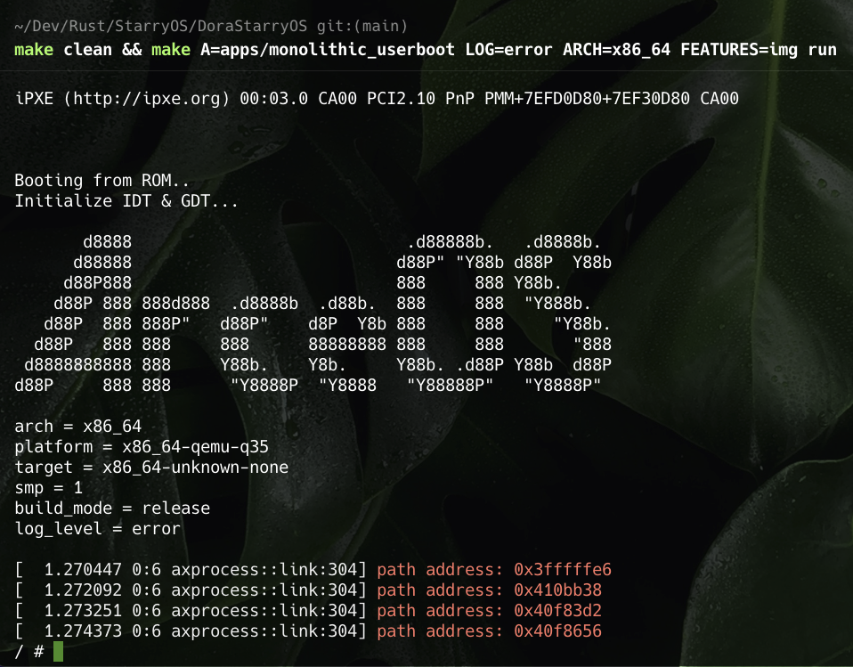

# Dora在 x86_64 架构中的 ArceOS 运行


## 1 搭建环境

**重要提醒**

> 最新组件化拆分后的`StarryOS`具体的命令参数和详解参考[最新版本`StarryOS`环境搭建说明](../os/new-starry-os.md)

在`Linux`中构建磁盘文件比较方便, 只需要一条命令即可

```shell
$ ./build_img.sh -a x86_64
```

由于`技安`使用的`macOS`系统, 具体的操作方式可参考[`macOS`开发`StarryOS`环境部署说明](../os/starryos-macos.md)

开发环境搭建完成后, 我们需要做的就是把编译好的`dora`可执行程序放在磁盘的根目录下面.    
假设您已经编译完成`dora`, 并且把`dora`存放在当前工作目录下.

### 把`dora`二进制文件放到磁盘中

#### `ubuntu`可以使用如下方法

```shell
$ mkdir rootfs  # 创建 rootfs 文件夹，用以挂载磁盘文件
$ sudo losetup /dev/loop50 disk.img
$ sudo mount /dev/loop50 rootfs
$ sudo cp dora rootfs
$ sudo umount rootfs
$ sudo losetup -d /dev/loop50
```

知识点说明:

* `losetup`命令用来设置循环设备。循环设备可把文件虚拟成块设备，籍此来模拟整个文件系统，让用户得以将其视为硬盘驱动器，光驱或软驱等设备，并挂入当作目录来使用。
* `loop`设备介绍: 在类 `UNIX` 系统里，`loop` 设备是一种伪设备(`pseudo-device`)，或者也可以说是仿真设备，它将一个文件映射成块设备，从而实现对文件的读写操作。`loop`设备一般以`/dev/loop`开头，如`/dev/loop0`、`/dev/loop1`等。它能使我们像块设备一样访问一个文件。在使用之前，一个 `loop` 设备必须要和一个文件进行连接。这种结合方式给用户提供了一个替代块特殊文件的接口。因此，如果这个文件包含有一个完整的文件系统，那么这个文件就可以像一个磁盘设备一样被 `mount` 起来。
* `loop50`是我选的在系统中是一个不存在的设备,如果你的系统中存在这个设备,需要更换一下后面的编号,保证唯一性.

#### `macOS`系统下操作步骤

**可视化操作**

* 双击打开`disk.img`文件
* 系统会自动挂在到新的磁盘中,在`Finder`中选中磁盘或者桌面双击挂在的磁盘. 把`dora`复制到磁盘根目录中.
* 弹出磁盘完成文件的复制.

**命令操作**

```shell
$ mkdir mnt # 创建 mnt 文件夹，用以挂载磁盘文件
$ hdiutil attach disk.img -mountpoint mnt   # 附加磁盘镜像挂在在 mnt 文件夹中
$ cp dora mnt
$ hdiutil detach mnt    # 从系统中分离分盘镜像
```

知识点说明:

* `hdiutil`: 磁盘映像工具，用于管理磁盘映像文件。详细说明可查看[`hdiutil`工具](../other/hdiutil.md)

## 2 运行`dora`

执行如下命令
```shell
$ make clean && make A=apps/monolithic_userboot LOG=error ARCH=x86_64 FEATURES=img run
```

先清空`make`缓存, 再启动`StarryOS`

启动后将出现如下图所示



在当前的`shell`中输入`/dora -h`命令,如果不出意外的话会有一个错误提示.

```shell
/dora: error while loading shared libraries: libgcc_s.so.1: cannot open shared object file: No such file or directory
```

说明系统缺少动态库`libgcc_s.so.1`文件. 这个动态库文件我们可以通过`x86_64`架构下的`ubuntu 22.04`系统中的`/lib/x86_64-linux-gnu/`目录下去寻找缺少的动态库文件. 并把它复制到当前的磁盘的`/lib`目录下.

**注意**
> 每次补全一个缺少的动态库之后,需要清空`make`缓存之后,再构建运行系统才可以生效.

整理各个架构下所需要的动态库文件

* `x86_64`: `/lib/x86_64-linux-gnu/`
* `aarch64`: `/lib/aarch64-linux-gnu/`
* `riscv64`: `/lib/risscv64-linux-gnu/`

| 动态库文件                    | `x86_64` | `aarch64` | `riscv64` |
| ----------------------------- | -------- | --------- | --------- |
| `libgcc_s.so.1`               | √        | √         | √         |
| `libm.so.6`                   | √        | √         | √         |
| `ld-linux-aarch64.so.1`       |          | √         |           |
| `libdl.so.2`                  |          | √         |           |
| `librt.so.1`                  |          | √         |           |
| `libc.so.6`                   |          | √         | √         |
| `libpthread.so.0`             |          | √         |           |
| `ld-linux-riscv64-lp64d.so.1` |          |           | √         |
| `libz.so.1`                   |          |           | √         |


把缺少的动态库全部补全之后, 运行`/dora -h`的效果如下:

```shell
SeaBIOS (version rel-1.16.2-0-gea1b7a073390-prebuilt.qemu.org)


iPXE (http://ipxe.org) 00:03.0 CA00 PCI2.10 PnP PMM+7EFD0D80+7EF30D80 CA00


Booting from ROM..
Initialize IDT & GDT...

       d8888                            .d88888b.   .d8888b.
      d88888                           d88P" "Y88b d88P  Y88b
     d88P888                           888     888 Y88b.
    d88P 888 888d888  .d8888b  .d88b.  888     888  "Y888b.
   d88P  888 888P"   d88P"    d8P  Y8b 888     888     "Y88b.
  d88P   888 888     888      88888888 888     888       "888
 d8888888888 888     Y88b.    Y8b.     Y88b. .d88P Y88b  d88P
d88P     888 888      "Y8888P  "Y8888   "Y88888P"   "Y8888P"

arch = x86_64
platform = x86_64-qemu-q35
target = x86_64-unknown-none
smp = 1
build_mode = release
log_level = error

[  1.263169 0:6 axprocess::link:304] path address: 0x3fffffe6
[  1.264362 0:6 axprocess::link:304] path address: 0x410bb38
[  1.265586 0:6 axprocess::link:304] path address: 0x40f83d2
[  1.266719 0:6 axprocess::link:304] path address: 0x40f8656
/ # /dora -h
[ 39.728294 0:8 axprocess::link:304] path address: 0x18b8
[ 40.063580 0:8 axprocess::link:304] path address: 0x403b2e0
         7:	file=/dora [0];  generating link map
         7:	  dynamic: 0x00000000014e5600  base: 0x0000000000001000   size: 0x00000000014f9d18
         7:	    entry: 0x00000000001b2570  phdr: 0x0000000000001040  phnum:                 14
         7:	
[ 40.084003 0:8 axprocess::link:304] path address: 0x402fd90
         7:	
         7:	file=libgcc_s.so.1 [0];  needed by /dora [0]
[ 40.087464 0:8 axprocess::link:304] path address: 0x3fffece0
[ 40.088668 0:8 axprocess::link:304] path address: 0x3fffece0
[ 40.089849 0:8 axprocess::link:304] path address: 0x3fffece0
[ 40.091157 0:8 axprocess::link:304] path address: 0x3fffece0
[ 40.092352 0:8 axprocess::link:304] path address: 0x3fffece0
[ 40.093765 0:8 axprocess::link:304] path address: 0x3fffece0
[ 40.095157 0:8 axprocess::link:304] path address: 0x3fffece0
[ 40.096448 0:8 axprocess::link:304] path address: 0x3fffece0
[ 40.097689 0:8 axprocess::link:304] path address: 0x3fffece0
[ 40.098987 0:8 axprocess::link:304] path address: 0x402eee9
         7:	file=libgcc_s.so.1 [0];  generating link map
         7:	  dynamic: 0x0000000001519de0  base: 0x00000000014fb000   size: 0x000000000001f2e8
         7:	    entry: 0x00000000014fb000  phdr: 0x00000000014fb040  phnum:                 11
         7:	
         7:	
         7:	file=libm.so.6 [0];  needed by /dora [0]
[ 40.105764 0:8 axprocess::link:304] path address: 0x3fffecc0
[ 40.107634 0:8 axprocess::link:304] path address: 0x402eee9
         7:	file=libm.so.6 [0];  generating link map
         7:	  dynamic: 0x0000000001602d90  base: 0x000000000151d000   size: 0x00000000000e6108
         7:	    entry: 0x000000000151d000  phdr: 0x000000000151d040  phnum:                 11
         7:	
         7:	
         7:	file=libc.so.6 [0];  needed by /dora [0]
[ 40.114278 0:8 axprocess::link:304] path address: 0x3fffeca0
[ 40.116001 0:8 axprocess::link:304] path address: 0x402eee9
         7:	file=libc.so.6 [0];  generating link map
         7:	  dynamic: 0x000000000181cbc0  base: 0x0000000001604000   size: 0x0000000000227e50
         7:	    entry: 0x000000000162df50  phdr: 0x0000000001604040  phnum:                 14
         7:	
         7:	
         7:	calling init: /lib64/ld-linux-x86-64.so.2
         7:	
         7:	
         7:	calling init: /lib/libc.so.6
         7:	
         7:	
         7:	calling init: /lib/libm.so.6
         7:	
         7:	
         7:	calling init: /lib/libgcc_s.so.1
         7:	
         7:	
         7:	initialize program: /dora
         7:	
         7:	
         7:	transferring control: /dora
         7:	
[ 41.134514 0:8 axprocess::link:304] path address: 0x17dd556
dora-rs cli client

Usage: dora <COMMAND>

Commands:
  check        Check if the coordinator and the daemon is running
  graph        Generate a visualization of the given graph using mermaid.js. Use --open to open
                   browser
  build        Run build commands provided in the given dataflow
  new          Generate a new project, node or operator. Choose the language between Rust,
                   Python, C or C++
  up           Spawn a coordinator and a daemon
  destroy      Destroy running coordinator and daemon. If some dataflows are still running, they
                   will be stopped first
  start        Start the given dataflow path. Attach a name to the running dataflow by using
                   --name
  stop         Stop the given dataflow UUID. If no id is provided, you will be able to choose
                   between the running dataflows
  list         List running dataflows
  logs         Show logs of a given dataflow and node
  daemon       Run daemon
  runtime      Run runtime
  coordinator  Run coordinator
  help         Print this message or the help of the given subcommand(s)

Options:
  -h, --help     Print help
  -V, --version  Print version
         7:	
         7:	calling fini: /dora [0]
         7:	
         7:	
         7:	calling fini: /lib/libgcc_s.so.1 [0]
         7:	
         7:	
         7:	calling fini: /lib/libm.so.6 [0]
         7:	
[ 41.399522 0:6 axprocess::link:304] path address: 0x40f8656
```

至此`dora -h`已经成功的运行起来了。