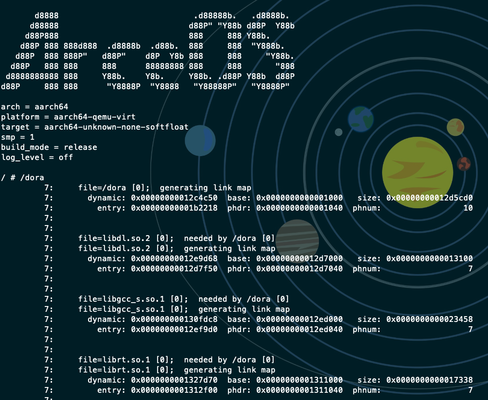
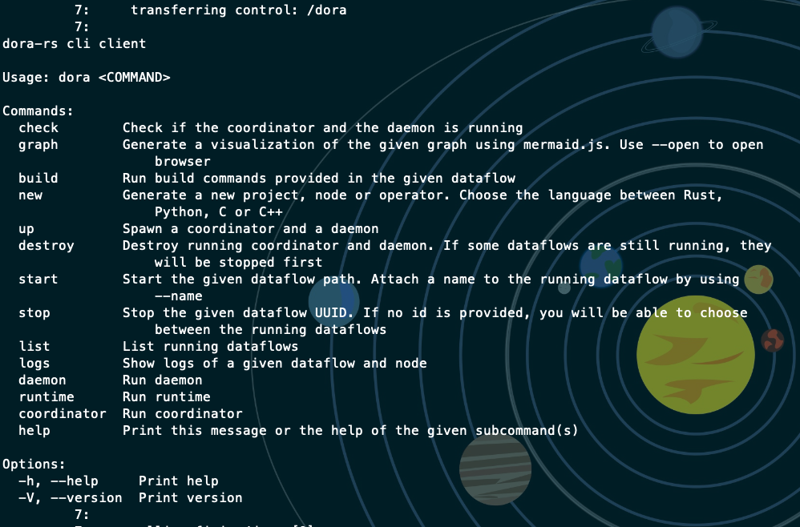

# Dora在 ArceOS 执行分析并成功运行 Dora

在`aarch64`架构下的`ArceOS`执行`dora`会直接报错

```shell
qemu-system-aarch64 -m 2G -smp 1 -cpu cortex-a72 -machine virt -kernel apps/monolithic_userboot/monolithic_userboot_aarch64-qemu-virt.bin -device virtio-blk-device,drive=disk0 -drive id=disk0,if=none,format=raw,file=disk.img -device virtio-net-device,netdev=net0 -netdev user,id=net0,hostfwd=tcp::5555-:5555,hostfwd=udp::5555-:5555 -nographic

       d8888                            .d88888b.   .d8888b.
      d88888                           d88P" "Y88b d88P  Y88b
     d88P888                           888     888 Y88b.
    d88P 888 888d888  .d8888b  .d88b.  888     888  "Y888b.
   d88P  888 888P"   d88P"    d8P  Y8b 888     888     "Y88b.
  d88P   888 888     888      88888888 888     888       "888
 d8888888888 888     Y88b.    Y8b.     Y88b. .d88P Y88b  d88P
d88P     888 888      "Y8888P  "Y8888   "Y88888P"   "Y8888P"

arch = aarch64
platform = aarch64-qemu-virt
target = aarch64-unknown-none-softfloat
smp = 1
build_mode = release
log_level = error

/ # ./dora
[ 33.435612 0:8 axprocess::process:395] Failed to load app /dora
```

经过调试程序并修复各种错误后，可以成功的运行`dora -h`。

运行后的效果详见下图：



