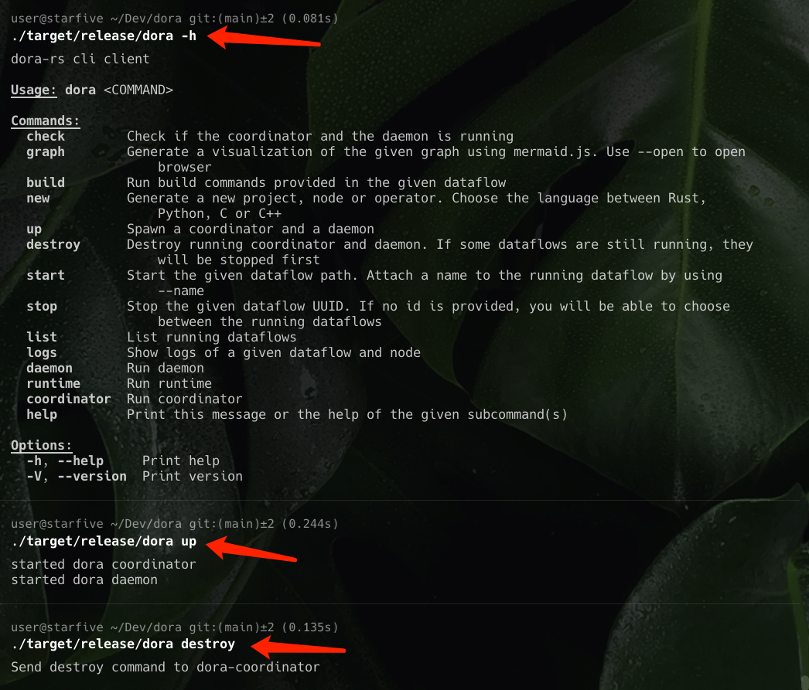
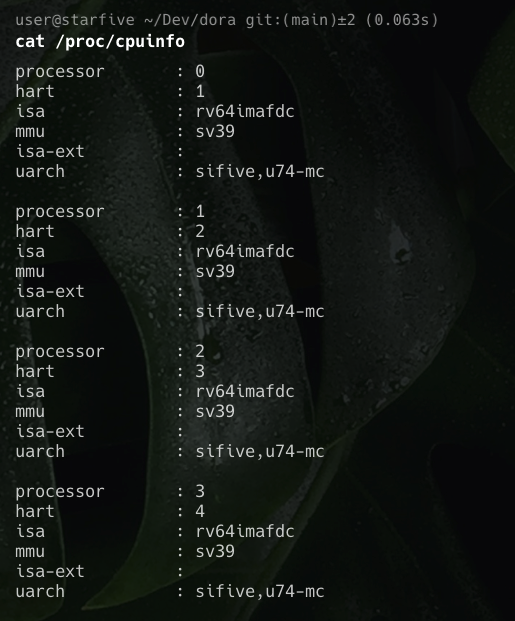

# Dora在 RISCV64架构中运行

开发板使用的是`昉·星光 2`。`VisionFive 2`是全球首款集成`3D GPU`的高性能量产`RISC-V`单板计算机 。与上一代相比，`VisionFive 2`全面升级，在处理器工作频率、多媒体处理能力、可扩展性等方面都有显着提升。优越的性能和合理的价格使`VisionFive 2`成为有史以来性价比最高的`RISC-V`开发板。


最终运行效果






## 系统调用分析

```shell
dora-rs cli client

Usage: dora <COMMAND>

Commands:
  check        Check if the coordinator and the daemon is running
  graph        Generate a visualization of the given graph using mermaid.js. Use --open to open
                   browser
  build        Run build commands provided in the given dataflow
  new          Generate a new project, node or operator. Choose the language between Rust,
                   Python, C or C++
  up           Spawn a coordinator and a daemon
  destroy      Destroy running coordinator and daemon. If some dataflows are still running, they
                   will be stopped first
  start        Start the given dataflow path. Attach a name to the running dataflow by using
                   --name
  stop         Stop the given dataflow UUID. If no id is provided, you will be able to choose
                   between the running dataflows
  list         List running dataflows
  logs         Show logs of a given dataflow and node
  daemon       Run daemon
  runtime      Run runtime
  coordinator  Run coordinator
  help         Print this message or the help of the given subcommand(s)

Options:
  -h, --help     Print help
  -V, --version  Print version
% time     seconds  usecs/call     calls    errors syscall
------ ----------- ----------- --------- --------- ----------------
 45.91    0.014351       14351         1           write
 22.24    0.006952        6952         1           execve
  9.74    0.003043         253        12           mmap
  4.92    0.001539         219         7           mprotect
  4.76    0.001488         297         5         1 openat
  3.04    0.000950         237         4           read
  1.63    0.000511         510         1         1 faccessat
  1.49    0.000467         116         4           fstat
  1.38    0.000432          54         8           ioctl
  1.01    0.000317         317         1           munmap
  0.92    0.000288          96         3           sigaltstack
  0.85    0.000267          89         3           brk
  0.80    0.000250          62         4           close
  0.48    0.000149         149         1           ppoll
  0.24    0.000075          75         1           set_tid_address
  0.22    0.000069          69         1           set_robust_list
  0.22    0.000068          13         5           rt_sigaction
  0.13    0.000041          41         1         1 getrandom
  0.00    0.000000           0         1           prlimit64
------ ----------- ----------- --------- --------- ----------------
100.00    0.031257         488        64         3 total
```

```shell
execve("/bin/dora", ["/bin/dora"], 0x7ffff3ab2d90 /* 5 vars */) = 0
brk(NULL)                               = 0x55555a679000
faccessat(AT_FDCWD, "/etc/ld.so.preload", R_OK) = -1 ENOENT (No such file or directory)
openat(AT_FDCWD, "/lib/libz.so.1", O_RDONLY|O_CLOEXEC) = 3
read(3, "\177ELF\2\1\1\0\0\0\0\0\0\0\0\0\3\0\363\0\1\0\0\0\0\0\0\0\0\0\0\0"..., 832) = 832
fstat(3, {st_mode=S_IFREG|0644, st_size=84280, ...}) = 0
mmap(NULL, 8192, PROT_READ|PROT_WRITE, MAP_PRIVATE|MAP_ANONYMOUS, -1, 0) = 0x7fff9ca57000
mmap(NULL, 82384, PROT_READ|PROT_EXEC, MAP_PRIVATE|MAP_DENYWRITE, 3, 0) = 0x7fff9ca42000
mmap(0x7fff9ca55000, 8192, PROT_READ|PROT_WRITE, MAP_PRIVATE|MAP_FIXED|MAP_DENYWRITE, 3, 0x13000) = 0x7fff9ca55000
close(3)                                = 0
openat(AT_FDCWD, "/lib/libgcc_s.so.1", O_RDONLY|O_CLOEXEC) = 3
read(3, "\177ELF\2\1\1\0\0\0\0\0\0\0\0\0\3\0\363\0\1\0\0\0\0\0\0\0\0\0\0\0"..., 832) = 832
fstat(3, {st_mode=S_IFREG|0755, st_size=498168, ...}) = 0
mmap(NULL, 99120, PROT_READ|PROT_EXEC, MAP_PRIVATE|MAP_DENYWRITE, 3, 0) = 0x7fff9ca29000
mmap(0x7fff9ca40000, 8192, PROT_READ|PROT_WRITE, MAP_PRIVATE|MAP_FIXED|MAP_DENYWRITE, 3, 0x16000) = 0x7fff9ca40000
close(3)                                = 0
openat(AT_FDCWD, "/lib/libm.so.6", O_RDONLY|O_CLOEXEC) = 3
read(3, "\177ELF\2\1\1\0\0\0\0\0\0\0\0\0\3\0\363\0\1\0\0\0\0\0\0\0\0\0\0\0"..., 832) = 832
fstat(3, {st_mode=S_IFREG|0755, st_size=730824, ...}) = 0
mmap(NULL, 516224, PROT_READ|PROT_EXEC, MAP_PRIVATE|MAP_DENYWRITE, 3, 0) = 0x7fff9c9aa000
mmap(0x7fff9ca27000, 8192, PROT_READ|PROT_WRITE, MAP_PRIVATE|MAP_FIXED|MAP_DENYWRITE, 3, 0x7d000) = 0x7fff9ca27000
close(3)                                = 0
openat(AT_FDCWD, "/lib/libc.so.6", O_RDONLY|O_CLOEXEC) = 3
read(3, "\177ELF\2\1\1\3\0\0\0\0\0\0\0\0\3\0\363\0\1\0\0\0\364\271\2\0\0\0\0\0"..., 832) = 832
fstat(3, {st_mode=S_IFREG|0755, st_size=2010248, ...}) = 0
mmap(NULL, 1560760, PROT_READ|PROT_EXEC, MAP_PRIVATE|MAP_DENYWRITE, 3, 0) = 0x7fff9c82c000
mmap(0x7fff9c998000, 20480, PROT_READ|PROT_WRITE, MAP_PRIVATE|MAP_FIXED|MAP_DENYWRITE, 3, 0x16c000) = 0x7fff9c998000
mmap(0x7fff9c99d000, 49336, PROT_READ|PROT_WRITE, MAP_PRIVATE|MAP_FIXED|MAP_ANONYMOUS, -1, 0) = 0x7fff9c99d000
close(3)                                = 0
mmap(NULL, 8192, PROT_READ|PROT_WRITE, MAP_PRIVATE|MAP_ANONYMOUS, -1, 0) = 0x7fff9c82a000
set_tid_address(0x7fff9c82a510)         = 46
set_robust_list(0x7fff9c82a520, 24)     = 0
mprotect(0x7fff9c998000, 12288, PROT_READ) = 0
mprotect(0x7fff9ca27000, 4096, PROT_READ) = 0
mprotect(0x7fff9ca40000, 4096, PROT_READ) = 0
mprotect(0x7fff9ca55000, 4096, PROT_READ) = 0
mprotect(0x55555a56a000, 978944, PROT_READ) = 0
mprotect(0x7fff9ca7f000, 8192, PROT_READ) = 0
prlimit64(0, RLIMIT_STACK, NULL, {rlim_cur=8192*1024, rlim_max=RLIM64_INFINITY}) = 0
ppoll([{fd=0, events=0}, {fd=1, events=0}, {fd=2, events=0}], 3, {tv_sec=0, tv_nsec=0}, NULL, 0) = 0 (Timeout)
rt_sigaction(SIGPIPE, {sa_handler=SIG_IGN, sa_mask=[PIPE], sa_flags=SA_RESTART}, {sa_handler=SIG_DFL, sa_mask=[], sa_flags=0}, 8) = 0
rt_sigaction(SIGSEGV, NULL, {sa_handler=SIG_DFL, sa_mask=[], sa_flags=0}, 8) = 0
rt_sigaction(SIGSEGV, {sa_handler=0x555559faeef2, sa_mask=[], sa_flags=SA_ONSTACK|SA_SIGINFO}, NULL, 8) = 0
rt_sigaction(SIGBUS, NULL, {sa_handler=SIG_DFL, sa_mask=[], sa_flags=0}, 8) = 0
rt_sigaction(SIGBUS, {sa_handler=0x555559faeef2, sa_mask=[], sa_flags=SA_ONSTACK|SA_SIGINFO}, NULL, 8) = 0
sigaltstack(NULL, {ss_sp=NULL, ss_flags=SS_DISABLE, ss_size=0}) = 0
mmap(NULL, 12288, PROT_READ|PROT_WRITE, MAP_PRIVATE|MAP_ANONYMOUS|MAP_STACK, -1, 0) = 0x7fff9c827000
mprotect(0x7fff9c827000, 4096, PROT_NONE) = 0
sigaltstack({ss_sp=0x7fff9c828000, ss_flags=0, ss_size=8192}, NULL) = 0
getrandom(0x7fff9c9a18c0, 8, GRND_NONBLOCK) = -1 EAGAIN (Resource temporarily unavailable)
brk(NULL)                               = 0x55555a679000
brk(0x55555a69a000)                     = 0x55555a69a000
openat(AT_FDCWD, "/proc/self/maps", O_RDONLY|O_CLOEXEC) = -1 ENOENT (No such file or directory)
ioctl(1, TIOCGWINSZ, {ws_row=0, ws_col=0, ws_xpixel=0, ws_ypixel=0}) = 0
ioctl(1, TIOCGWINSZ, {ws_row=0, ws_col=0, ws_xpixel=0, ws_ypixel=0}) = 0
ioctl(2, TIOCGWINSZ, {ws_row=0, ws_col=0, ws_xpixel=0, ws_ypixel=0}) = 0
ioctl(2, TIOCGWINSZ, {ws_row=0, ws_col=0, ws_xpixel=0, ws_ypixel=0}) = 0
ioctl(0, TIOCGWINSZ, {ws_row=0, ws_col=0, ws_xpixel=0, ws_ypixel=0}) = 0
ioctl(0, TIOCGWINSZ, {ws_row=0, ws_col=0, ws_xpixel=0, ws_ypixel=0}) = 0
ioctl(2, TCGETS, {c_iflag=ICRNL|IXON, c_oflag=NL0|CR0|TAB0|BS0|VT0|FF0|OPOST|ONLCR, c_cflag=B9600|CS8|CREAD|HUPCL|CLOCAL, c_lflag=ISIG|ICANON|ECHO|ECHOE|ECHOK|IEXTEN|ECHOCTL|ECHOKE, ...}) = 0
ioctl(2, TCGETS, {c_iflag=ICRNL|IXON, c_oflag=NL0|CR0|TAB0|BS0|VT0|FF0|OPOST|ONLCR, c_cflag=B9600|CS8|CREAD|HUPCL|CLOCAL, c_lflag=ISIG|ICANON|ECHO|ECHOE|ECHOK|IEXTEN|ECHOCTL|ECHOKE, ...}) = 0
write(2, "dora-rs cli client\n\n\33[1m\33[4mUsag"..., 1388dora-rs cli client

Usage: dora <COMMAND>

Commands:
  check        Check if the coordinator and the daemon is running
  graph        Generate a visualization of the given graph using mermaid.js. Use --open to open
                   browser
  build        Run build commands provided in the given dataflow
  new          Generate a new project, node or operator. Choose the language between Rust,
                   Python, C or C++
  up           Spawn a coordinator and a daemon
  destroy      Destroy running coordinator and daemon. If some dataflows are still running, they
                   will be stopped first
  start        Start the given dataflow path. Attach a name to the running dataflow by using
                   --name
  stop         Stop the given dataflow UUID. If no id is provided, you will be able to choose
                   between the running dataflows
  list         List running dataflows
  logs         Show logs of a given dataflow and node
  daemon       Run daemon
  runtime      Run runtime
  coordinator  Run coordinator
  help         Print this message or the help of the given subcommand(s)

Options:
  -h, --help     Print help
  -V, --version  Print version
) = 1388
sigaltstack({ss_sp=NULL, ss_flags=SS_DISABLE, ss_size=8192}, NULL) = 0
munmap(0x7fff9c827000, 12288)           = 0
exit_group(2)
```


#### `dora up`

```shell
failed to start dora-coordinator: failed to get current executable path: no /proc/self/exe available. Is /proc mounted?
% time     seconds  usecs/call     calls    errors syscall
------ ----------- ----------- --------- --------- ----------------
 25.96    0.005635        5635         1           execve
 13.50    0.002930         244        12           mmap
 10.81    0.002347         469         5           close
  9.69    0.002104         350         6           write
  6.46    0.001401         200         7           mprotect
  6.33    0.001373         274         5         1 openat
  5.42    0.001176        1176         1           socket
  5.13    0.001114        1114         1         1 connect
  4.51    0.000978         244         4           read
  2.63    0.000571         142         4           fstat
  2.56    0.000555         277         2         2 statx
  2.28    0.000494         247         2         1 getrandom
  0.81    0.000175         175         1           ppoll
  0.78    0.000170          34         5           rt_sigaction
  0.65    0.000140         140         1         1 faccessat
  0.59    0.000127         127         1         1 readlinkat
  0.48    0.000105          35         3           brk
  0.42    0.000091          30         3           sigaltstack
  0.38    0.000083          83         1           prlimit64
  0.32    0.000069          69         1           set_tid_address
  0.30    0.000065          65         1           set_robust_list
  0.00    0.000000           0         1           munmap
------ ----------- ----------- --------- --------- ----------------
100.00    0.021703         319        68         7 total
```

```shell
execve("/bin/dora", ["/bin/dora", "up"], 0x7fffe7866d88 /* 5 vars */) = 0
brk(NULL)                               = 0x555591f60000
faccessat(AT_FDCWD, "/etc/ld.so.preload", R_OK) = -1 ENOENT (No such file or directory)
openat(AT_FDCWD, "/lib/libz.so.1", O_RDONLY|O_CLOEXEC) = 3
read(3, "\177ELF\2\1\1\0\0\0\0\0\0\0\0\0\3\0\363\0\1\0\0\0\0\0\0\0\0\0\0\0"..., 832) = 832
fstat(3, {st_mode=S_IFREG|0644, st_size=84280, ...}) = 0
mmap(NULL, 8192, PROT_READ|PROT_WRITE, MAP_PRIVATE|MAP_ANONYMOUS, -1, 0) = 0x7fff9bcb8000
mmap(NULL, 82384, PROT_READ|PROT_EXEC, MAP_PRIVATE|MAP_DENYWRITE, 3, 0) = 0x7fff9bca3000
mmap(0x7fff9bcb6000, 8192, PROT_READ|PROT_WRITE, MAP_PRIVATE|MAP_FIXED|MAP_DENYWRITE, 3, 0x13000) = 0x7fff9bcb6000
close(3)                                = 0
openat(AT_FDCWD, "/lib/libgcc_s.so.1", O_RDONLY|O_CLOEXEC) = 3
read(3, "\177ELF\2\1\1\0\0\0\0\0\0\0\0\0\3\0\363\0\1\0\0\0\0\0\0\0\0\0\0\0"..., 832) = 832
fstat(3, {st_mode=S_IFREG|0755, st_size=498168, ...}) = 0
mmap(NULL, 99120, PROT_READ|PROT_EXEC, MAP_PRIVATE|MAP_DENYWRITE, 3, 0) = 0x7fff9bc8a000
mmap(0x7fff9bca1000, 8192, PROT_READ|PROT_WRITE, MAP_PRIVATE|MAP_FIXED|MAP_DENYWRITE, 3, 0x16000) = 0x7fff9bca1000
close(3)                                = 0
openat(AT_FDCWD, "/lib/libm.so.6", O_RDONLY|O_CLOEXEC) = 3
read(3, "\177ELF\2\1\1\0\0\0\0\0\0\0\0\0\3\0\363\0\1\0\0\0\0\0\0\0\0\0\0\0"..., 832) = 832
fstat(3, {st_mode=S_IFREG|0755, st_size=730824, ...}) = 0
mmap(NULL, 516224, PROT_READ|PROT_EXEC, MAP_PRIVATE|MAP_DENYWRITE, 3, 0) = 0x7fff9bc0b000
mmap(0x7fff9bc88000, 8192, PROT_READ|PROT_WRITE, MAP_PRIVATE|MAP_FIXED|MAP_DENYWRITE, 3, 0x7d000) = 0x7fff9bc88000
close(3)                                = 0
openat(AT_FDCWD, "/lib/libc.so.6", O_RDONLY|O_CLOEXEC) = 3
read(3, "\177ELF\2\1\1\3\0\0\0\0\0\0\0\0\3\0\363\0\1\0\0\0\364\271\2\0\0\0\0\0"..., 832) = 832
fstat(3, {st_mode=S_IFREG|0755, st_size=2010248, ...}) = 0
mmap(NULL, 1560760, PROT_READ|PROT_EXEC, MAP_PRIVATE|MAP_DENYWRITE, 3, 0) = 0x7fff9ba8d000
mmap(0x7fff9bbf9000, 20480, PROT_READ|PROT_WRITE, MAP_PRIVATE|MAP_FIXED|MAP_DENYWRITE, 3, 0x16c000) = 0x7fff9bbf9000
mmap(0x7fff9bbfe000, 49336, PROT_READ|PROT_WRITE, MAP_PRIVATE|MAP_FIXED|MAP_ANONYMOUS, -1, 0) = 0x7fff9bbfe000
close(3)                                = 0
mmap(NULL, 8192, PROT_READ|PROT_WRITE, MAP_PRIVATE|MAP_ANONYMOUS, -1, 0) = 0x7fff9ba8b000
set_tid_address(0x7fff9ba8b510)         = 59
set_robust_list(0x7fff9ba8b520, 24)     = 0
mprotect(0x7fff9bbf9000, 12288, PROT_READ) = 0
mprotect(0x7fff9bc88000, 4096, PROT_READ) = 0
mprotect(0x7fff9bca1000, 4096, PROT_READ) = 0
mprotect(0x7fff9bcb6000, 4096, PROT_READ) = 0
mprotect(0x555591e51000, 978944, PROT_READ) = 0
mprotect(0x7fff9bce0000, 8192, PROT_READ) = 0
prlimit64(0, RLIMIT_STACK, NULL, {rlim_cur=8192*1024, rlim_max=RLIM64_INFINITY}) = 0
ppoll([{fd=0, events=0}, {fd=1, events=0}, {fd=2, events=0}], 3, {tv_sec=0, tv_nsec=0}, NULL, 0) = 0 (Timeout)
rt_sigaction(SIGPIPE, {sa_handler=SIG_IGN, sa_mask=[PIPE], sa_flags=SA_RESTART}, {sa_handler=SIG_DFL, sa_mask=[], sa_flags=0}, 8) = 0
rt_sigaction(SIGSEGV, NULL, {sa_handler=SIG_DFL, sa_mask=[], sa_flags=0}, 8) = 0
rt_sigaction(SIGSEGV, {sa_handler=0x555591895ef2, sa_mask=[], sa_flags=SA_ONSTACK|SA_SIGINFO}, NULL, 8) = 0
rt_sigaction(SIGBUS, NULL, {sa_handler=SIG_DFL, sa_mask=[], sa_flags=0}, 8) = 0
rt_sigaction(SIGBUS, {sa_handler=0x555591895ef2, sa_mask=[], sa_flags=SA_ONSTACK|SA_SIGINFO}, NULL, 8) = 0
sigaltstack(NULL, {ss_sp=NULL, ss_flags=SS_DISABLE, ss_size=0}) = 0
mmap(NULL, 12288, PROT_READ|PROT_WRITE, MAP_PRIVATE|MAP_ANONYMOUS|MAP_STACK, -1, 0) = 0x7fff9ba88000
mprotect(0x7fff9ba88000, 4096, PROT_NONE) = 0
sigaltstack({ss_sp=0x7fff9ba89000, ss_flags=0, ss_size=8192}, NULL) = 0
getrandom(0x7fff9bc028c0, 8, GRND_NONBLOCK) = -1 EAGAIN (Resource temporarily unavailable)
brk(NULL)                               = 0x555591f60000
brk(0x555591f81000)                     = 0x555591f81000
openat(AT_FDCWD, "/proc/self/maps", O_RDONLY|O_CLOEXEC) = -1 ENOENT (No such file or directory)
getrandom("\x22\x03\xa1\x57\xeb\xb5\x16\xf1\x85\x07\x33\xf7\x29\xa1\x85\x0e", 16, GRND_INSECURE) = 16
statx(AT_FDCWD, "dora-config.yml", AT_STATX_SYNC_AS_STAT, STATX_ALL, 0x7fffd9dde158) = -1 ENOENT (No such file or directory)
statx(0, NULL, AT_STATX_SYNC_AS_STAT, STATX_ALL, NULL) = -1 EFAULT (Bad address)
socket(AF_INET, SOCK_STREAM|SOCK_CLOEXEC, IPPROTO_IP) = 3
connect(3, {sa_family=AF_INET, sin_port=htons(6012), sin_addr=inet_addr("127.0.0.1")}, 16) = -1 ENETUNREACH (Network is unreachable)
close(3)                                = 0
readlinkat(AT_FDCWD, "/proc/self/exe", 0x555591f66ce0, 256) = -1 ENOENT (No such file or directory)
write(2, "failed to start dora-coordinator", 32failed to start dora-coordinator) = 32
write(2, ": ", 2: )                       = 2
write(2, "failed to get current executable"..., 37failed to get current executable path) = 37
write(2, ": ", 2: )                       = 2
write(2, "no /proc/self/exe available. Is "..., 46no /proc/self/exe available. Is /proc mounted?) = 46
write(2, "\n", 1
)                       = 1
sigaltstack({ss_sp=NULL, ss_flags=SS_DISABLE, ss_size=8192}, NULL) = 0
munmap(0x7fff9ba88000, 12288)           = 0
exit_group(1)                           = ?
+++ exited with 1 +++
```