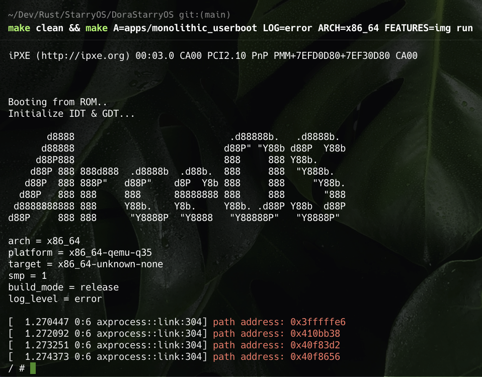

# 从零开始在 `StarryOS` 中运行 `Dora`
# 第二节：运行 `dora -h`

接着上一节, 我们已经搭建好了`StarryOS`的开发环境, 现在开始运行`StarryOS`系统.

执行如下命令
```shell
$ make clean && make A=apps/monolithic_userboot LOG=error ARCH=x86_64 FEATURES=img run
```

先清空`make`缓存, 再启动`StarryOS`

启动后将出现如下图所示



在当前的`shell`中输入`/dora -h`命令,如果不出意外的话会有一个错误提示.

```shell
/dora: error while loading shared libraries: libgcc_s.so.1: cannot open shared object file: No such file or directory
```

说明系统缺少动态库`libgcc_s.so.1`文件. 这个动态库文件我们可以通过`x86_64`架构下的`ubuntu 22.04`系统中的`/lib/x86_64-linux-gnu/`目录下去寻找缺少的动态库文件. 并把它复制到当前的磁盘的`/lib`目录下。

**注意**
> 每次补全一个缺少的动态库之后需要清空 `make` 缓存之后, 再构建运行系统才可以生效。
>
> 如此反复的看到提示缺少哪个的动态库，就复制过来。当然你也可以根据下面的表格对应的架构列出来的动态库文件，一次性的补全。

整理各个架构下所需要的动态库文件

* `x86_64`: `/lib/x86_64-linux-gnu/`
* `aarch64`: `/lib/aarch64-linux-gnu/`
* `riscv64`: `/lib/risscv64-linux-gnu/`

| 动态库文件                    | `x86_64` | `aarch64` | `riscv64` |
| ----------------------------- | -------- | --------- | --------- |
| `libgcc_s.so.1`               | √        | √         | √         |
| `libm.so.6`                   | √        | √         | √         |
| `ld-linux-aarch64.so.1`       |          | √         |           |
| `libdl.so.2`                  |          | √         |           |
| `librt.so.1`                  |          | √         |           |
| `libc.so.6`                   |          | √         | √         |
| `libpthread.so.0`             |          | √         |           |
| `ld-linux-riscv64-lp64d.so.1` |          |           | √         |
| `libz.so.1`                   |          |           | √         |


把缺少的动态库全部补全之后, 运行`/dora -h`的效果如下:

```shell
SeaBIOS (version rel-1.16.2-0-gea1b7a073390-prebuilt.qemu.org)


iPXE (http://ipxe.org) 00:03.0 CA00 PCI2.10 PnP PMM+7EFD0D80+7EF30D80 CA00


Booting from ROM..
Initialize IDT & GDT...

       d8888                            .d88888b.   .d8888b.
      d88888                           d88P" "Y88b d88P  Y88b
     d88P888                           888     888 Y88b.
    d88P 888 888d888  .d8888b  .d88b.  888     888  "Y888b.
   d88P  888 888P"   d88P"    d8P  Y8b 888     888     "Y88b.
  d88P   888 888     888      88888888 888     888       "888
 d8888888888 888     Y88b.    Y8b.     Y88b. .d88P Y88b  d88P
d88P     888 888      "Y8888P  "Y8888   "Y88888P"   "Y8888P"

arch = x86_64
platform = x86_64-qemu-q35
target = x86_64-unknown-none
smp = 1
build_mode = release
log_level = error

[  1.263169 0:6 axprocess::link:304] path address: 0x3fffffe6
[  1.264362 0:6 axprocess::link:304] path address: 0x410bb38
[  1.265586 0:6 axprocess::link:304] path address: 0x40f83d2
[  1.266719 0:6 axprocess::link:304] path address: 0x40f8656
/ # /dora -h
[ 39.728294 0:8 axprocess::link:304] path address: 0x18b8
[ 40.063580 0:8 axprocess::link:304] path address: 0x403b2e0
         7:	file=/dora [0];  generating link map
         7:	  dynamic: 0x00000000014e5600  base: 0x0000000000001000   size: 0x00000000014f9d18
         7:	    entry: 0x00000000001b2570  phdr: 0x0000000000001040  phnum:                 14
         7:	
[ 40.084003 0:8 axprocess::link:304] path address: 0x402fd90
         7:	
         7:	file=libgcc_s.so.1 [0];  needed by /dora [0]
[ 40.087464 0:8 axprocess::link:304] path address: 0x3fffece0
[ 40.088668 0:8 axprocess::link:304] path address: 0x3fffece0
[ 40.089849 0:8 axprocess::link:304] path address: 0x3fffece0
[ 40.091157 0:8 axprocess::link:304] path address: 0x3fffece0
[ 40.092352 0:8 axprocess::link:304] path address: 0x3fffece0
[ 40.093765 0:8 axprocess::link:304] path address: 0x3fffece0
[ 40.095157 0:8 axprocess::link:304] path address: 0x3fffece0
[ 40.096448 0:8 axprocess::link:304] path address: 0x3fffece0
[ 40.097689 0:8 axprocess::link:304] path address: 0x3fffece0
[ 40.098987 0:8 axprocess::link:304] path address: 0x402eee9
         7:	file=libgcc_s.so.1 [0];  generating link map
         7:	  dynamic: 0x0000000001519de0  base: 0x00000000014fb000   size: 0x000000000001f2e8
         7:	    entry: 0x00000000014fb000  phdr: 0x00000000014fb040  phnum:                 11
         7:	
         7:	
         7:	file=libm.so.6 [0];  needed by /dora [0]
[ 40.105764 0:8 axprocess::link:304] path address: 0x3fffecc0
[ 40.107634 0:8 axprocess::link:304] path address: 0x402eee9
         7:	file=libm.so.6 [0];  generating link map
         7:	  dynamic: 0x0000000001602d90  base: 0x000000000151d000   size: 0x00000000000e6108
         7:	    entry: 0x000000000151d000  phdr: 0x000000000151d040  phnum:                 11
         7:	
         7:	
         7:	file=libc.so.6 [0];  needed by /dora [0]
[ 40.114278 0:8 axprocess::link:304] path address: 0x3fffeca0
[ 40.116001 0:8 axprocess::link:304] path address: 0x402eee9
         7:	file=libc.so.6 [0];  generating link map
         7:	  dynamic: 0x000000000181cbc0  base: 0x0000000001604000   size: 0x0000000000227e50
         7:	    entry: 0x000000000162df50  phdr: 0x0000000001604040  phnum:                 14
         7:	
         7:	
         7:	calling init: /lib64/ld-linux-x86-64.so.2
         7:	
         7:	
         7:	calling init: /lib/libc.so.6
         7:	
         7:	
         7:	calling init: /lib/libm.so.6
         7:	
         7:	
         7:	calling init: /lib/libgcc_s.so.1
         7:	
         7:	
         7:	initialize program: /dora
         7:	
         7:	
         7:	transferring control: /dora
         7:	
[ 41.134514 0:8 axprocess::link:304] path address: 0x17dd556
dora-rs cli client

Usage: dora <COMMAND>

Commands:
  check        Check if the coordinator and the daemon is running
  graph        Generate a visualization of the given graph using mermaid.js. Use --open to open
                   browser
  build        Run build commands provided in the given dataflow
  new          Generate a new project, node or operator. Choose the language between Rust,
                   Python, C or C++
  up           Spawn a coordinator and a daemon
  destroy      Destroy running coordinator and daemon. If some dataflows are still running, they
                   will be stopped first
  start        Start the given dataflow path. Attach a name to the running dataflow by using
                   --name
  stop         Stop the given dataflow UUID. If no id is provided, you will be able to choose
                   between the running dataflows
  list         List running dataflows
  logs         Show logs of a given dataflow and node
  daemon       Run daemon
  runtime      Run runtime
  coordinator  Run coordinator
  help         Print this message or the help of the given subcommand(s)

Options:
  -h, --help     Print help
  -V, --version  Print version
         7:	
         7:	calling fini: /dora [0]
         7:	
         7:	
         7:	calling fini: /lib/libgcc_s.so.1 [0]
         7:	
         7:	
         7:	calling fini: /lib/libm.so.6 [0]
         7:	
[ 41.399522 0:6 axprocess::link:304] path address: 0x40f8656
```

至此`dora -h`已经成功的运行起来了。