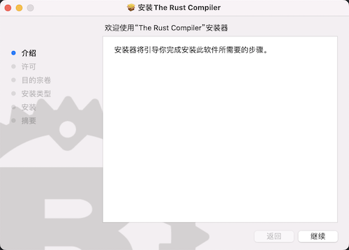

# MAC系统安装 `Rust`

可以通过运行以下命令获得 `C` 语言编译器：

```bash
$ xcode-select --install
```

`MAC` 系统安装 `Rust` 和 `Linux` 差不多

## 自动安装

```bash
$ curl --proto '=https' --tlsv1.2 -sSf https://sh.rustup.rs | sh
```

## 手动安装

由于 `MAC` 电脑存在 `intel` 和 `M`系列的芯片, 手动安装需要根据电脑的架构下载对应的安装文件.

[查看最新版的系统安装文件](https://forge.rust-lang.org/infra/other-installation-methods.html#standalone-installers)

`M` 芯片下载 [rust-1.68.2-aarch64-apple-darwin.pkg](https://static.rust-lang.org/dist/rust-1.68.2-aarch64-apple-darwin.pkg)

<!-- `https://static.rust-lang.org/dist/rust-1.68.2-aarch64-apple-darwin.pkg` -->

`intel` 芯片下载 [rust-1.68.2-x86_64-apple-darwin.pkg](https://static.rust-lang.org/dist/rust-1.68.2-x86_64-apple-darwin.pkg)

<!-- `https://static.rust-lang.org/dist/rust-1.68.2-x86_64-apple-darwin.pkg` -->


以 `intel` 芯片为例. 将`rust-1.68.2-x86_64-apple-darwin.pkg` 下载到 `~/Downloads` 文件夹下.

```bash
$ wget -c https://static.rust-lang.org/dist/rust-1.68.2-x86_64-apple-darwin.pkg
$ open rust-1.68.2-x86_64-apple-darwin.pkg
```

随后会打开 `Rust` 的安装向导, 根据向导提示一步一步的安装完成即可.



<span class="caption">The Rust Compiler 安装器</span>