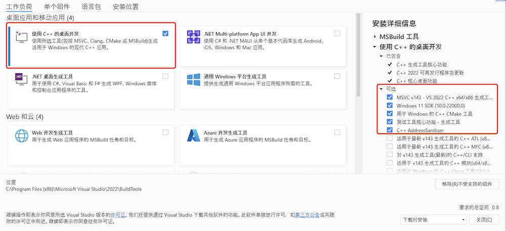
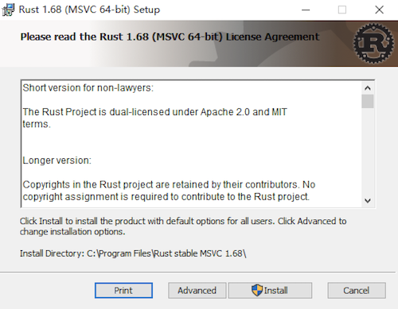

# Windows系统安装

## `MSVC`

### 安装 `MSVC` 构建工具

1、下载 [Visual Studio 2022 生成工具](https://aka.ms/vs/17/release/vs_BuildTools.exe)

2、安装 Visual Studio 2022 生成工具，分为两种安装方式，一种是图形化安装，另一种是命令式安装。

> 图形化安装

双击 `vs_BuildTools.exe` 打开。选中如下图所示的选项：



<span class="caption">图1 图形化安装</span>

* 使用 `C++` 的桌面开发
* `Windows 10 (或 11) SDK`
* 语言包中选中 `英语`，以及其他你需要的语言包

> 命令式安装

`vs_BuildTools.exe` 存放在 `C:\Echo` 目录下

```shell
PS C:\Echo> .\vs_BuildTools.exe --installPath "C:\VS" --add Microsoft.VisualStudio.Workload.VCTools --includeRecommended --await --passive --norestart
```
安装程序会自动的下载并安装所需的组件，整个过程自动化处理，安装完成后自动退出，整个过程无需人工干预。

命令参数详见

[使用命令行参数安装、更新和管理 Visual Studio](https://learn.microsoft.com/zh-cn/visualstudio/install/use-command-line-parameters-to-install-visual-studio)

[Visual Studio 生成工具组件目录](https://learn.microsoft.com/zh-cn/visualstudio/install/workload-component-id-vs-build-tools)

## 自动安装 `Rust`

下载 [rustup-init.exe](https://static.rust-lang.org/rustup/dist/i686-pc-windows-gnu/rustup-init.exe) 到 `C:\Echo` 目录下。

```shell
PS C:\Echo> .\rustup-init.exe

Welcome to Rust!

This will download and install the official compiler for the Rust
programming language, and its package manager, Cargo.

Rustup metadata and toolchains will be installed into the Rustup
home directory, located at:

  C:\Users\Echo\.rustup

This can be modified with the RUSTUP_HOME environment variable.

The Cargo home directory is located at:

  C:\Users\Echo\.cargo

This can be modified with the CARGO_HOME environment variable.

The cargo, rustc, rustup and other commands will be added to
Cargo's bin directory, located at:

  C:\Users\Echo\.cargo\bin

This path will then be added to your PATH environment variable by
modifying the HKEY_CURRENT_USER/Environment/PATH registry key.

You can uninstall at any time with rustup self uninstall and
these changes will be reverted.

Current installation options:


   default host triple: x86_64-pc-windows-msvc
     default toolchain: stable (default)
               profile: default
  modify PATH variable: yes

1) Proceed with installation (default)
2) Customize installation
3) Cancel installation
> 1                     # 输入1表示使用程序默认的安装方式自动安装当前最新版本以及对应的工具链
```
安装完成后按 `Enter` 键退出安装程序。

查看安装版本：
```shell
PS C:\Echo> cargo -V
cargo 1.68.2 (6feb7c9cf 2023-03-26)
PS C:\Echo> rustc -V
rustc 1.68.2 (9eb3afe9e 2023-03-27)
```

## 手动安装

下载 [rust-1.68.2-x86_64-pc-windows-msvc.msi](https://static.rust-lang.org/dist/rust-1.68.2-x86_64-pc-windows-msvc.msi) 到 `C:\Echo` 目录下。

进入 `C:\Echo`, 打开下载的 `rust-1.68.2-x86_64-pc-windows-msvc.msi` 文件，根据向导提示一步步安装即可。



<span class="caption">图2 手动安装</span>