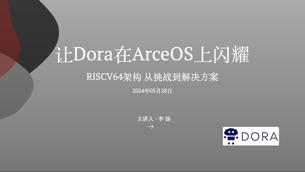

# 技安`Rust`笔记

## 简介

本书是一份学习`Rust`笔记，用于记录`技安`在学习`Rust`的过程中遇到的问题、解决思路和方法、学习感悟等。

## 作者简介

姓名：`李扬`    
网名：`技安`，由`技术`和`安全`这两个词结合而来。

有着`15`年互联网软件开发经验和`5`年`Rust`开发经验，同时也是一名创业者，从事软件开发相关的业务。在`2018`年开始接触`Rust`语言开始学习和使用它，现在工作中主要以`Rust`语言为主。核心工作是`数字图像算法`，`数字图像处理`，`AI人工智能`，`数字孪生`等。

目前主要发展方向是基于`Rust`语言的`操作系统`和`机器人具身智能`方向。

于`2014`年成立自己的软件公司`苏州幻果软件有限公司`[https://www.huanguosoft.com](https://www.huanguosoft.com)。

公司业务包含`Web`系统应用，移动端应用，桌面客户端应用，物联网应用，图像算法应用，`AI`人工智能应用，游戏，各种小程序，数字孪生等方向。

目前在清华大学参与`ArceOS`操作系统和`Rust`基金会下的基于`Dora`机器人系统的具身智能项目, 通过移植`Dora`到`ArceOS`操作系统和开放原子基金会开源鸿蒙系统`OpenHarmony`中。结合上层`AI`大模型，赋予机器人感知、学习和环境动态交互的能力。

`2024年5月28日`在`清华大学操作系统实验室`主办的`2024 春夏季开源操作系统训练营`上讲课。主讲的课程是：`让Dora在ArceOS上闪耀 —— RISC-V64架构`。

<!--  -->

---

感谢开源运动和开源软件赋予我们能够进一步的创造和改变世界的能力。

热爱开源，喜欢分享。可以加我微信一起交流。

