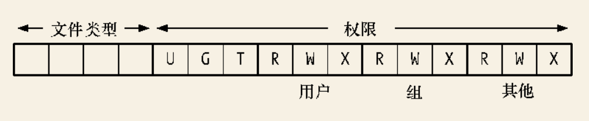

# 文件属性 stat,lstat,fstat系统调用

`x86_64`系统调用分析

## 系统调用号

- `stat`: 4
- `fstat`: 5
- `lstat`: 6

## `st_mode`文件类型及权限

`st_mode`字段所含各位的布局情况如下图:

`st_mode`字段的低12位定义了文件权限, 其中最低的9位分别用来表示文件宿主, 组群和其他用户的读,写,执行权限.

针对`stat`结构中的`st_mode`来检查文件类型的宏

| 常量       | 测试宏       | 文件类型     |
| ---------- | ------------ | ------------ |
| `S_IFREG`  | `S_ISREG()`  | 常规文件     |
| `S_IFDIR`  | `S_ISDIR()`  | 目录         |
| `S_IFCHR`  | `S_ISCHR()`  | 字符设备     |
| `S_IFBLK`  | `S_ISBLK()`  | 块设备       |
| `S_IFIFO`  | `S_ISFIFO()` | `FIFO`或管道 |
| `S_IFSOCK` | `S_ISSOCK()` | 套接字       |
| `S_IFLNK`  | `S_ISLNK()`  | 符号链接     |

// TODO 其它参数的介绍