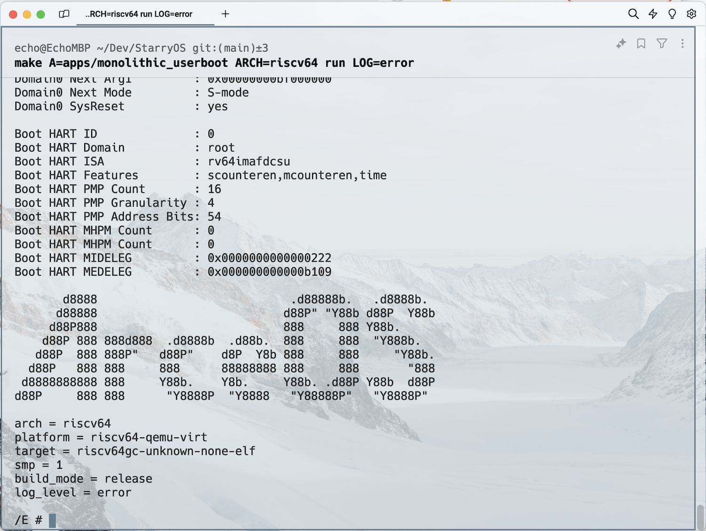

# 最新版本`StarryOS`环境搭建说明

> 说明: 本教程将构建一个`riscv64`架构下的宏内核系统. 主机系统使用的是`x86_64` 架构下的 `ubuntu 22.04 LTS`版本.

最新版本的`StarryOS`将所有的组件进行了组件化拆分, 使其成为一个个独立的`crate`.

本教程讲详细的介绍如何从零开始搭建`StarryOS`环境并成功运行一个宏内核系统.

1: 升级系统

```shell
sudo apt update -y
```

2: 安装必要的工具

```shell
sudo apt install -y curl wget vim git build-essential qemu-system
```

3: 安装`Rust`, 参考[Linux系统安装](../getting-started/install-linux.md)

```shell
curl --proto '=https' --tlsv1.2 -sSf https://sh.rustup.rs | sh
cargo install cargo-binutils
```

4: 克隆`StarryOS`

```shell
git clone https://github.com/Starry-OS/Starry.git
```

5: 更新子模块

```shell
cd Starry
git submodule update --init --recursive
```

6: 构建系统镜像详解

```shell
./build_img.sh -h

./build_img.sh -a [arch] -fs [filesystem] -file [testcast]
  -a | --arch		architecture: x86_64|riscv64|aarch64, default is x86_64
  -fs | --filesystem	filesystem: ext4|fat32, default is fat32
  -file | --testcase  If not specified, use the default testcases for different architectures.
  -s | --size		size of the disk image in 4MB batch size, default is set to 30, which means 120MB disk image
  default testcases:
    x86_64: x86_64_linux_musl
    riscv64: riscv64_linux_musl
    aarch64: aarch64-linux-musl
  -h | --help		display help
```

详细讲解构建参数

| 参数                       | 说明                                                                               | 默认值                              |
| -------------------------- | ---------------------------------------------------------------------------------- | ----------------------------------- |
| `-a` <br/> `--arch`        | 指定构建目标架构, 选项为`x86_64`, `riscv64`, `aarch64`                             | `x86_64`                            |
| `-fs` <br/> `--filesystem` | 文件系统, 选项为`ext4`, `fat32`                                                    | `fat32`                             |
| `-file` <br/> `--testcase` | 测试用例, 如果不指定测试用例, 将采用架构的默认测试用例, 不同的架构测试用例详见下表 | -                                   |
| `-s` <br/> `--size`        | 磁盘镜像`blocks`块的数量, 一个`block`大小为`4MB`                                   | `30`, 表示默认磁盘镜像大小为`120MB` |
| `-h` <br/> `--help`        | 帮助说明                                                                           | -                                   |

默认测试用例

| 架构      | 默认测试用例                            |
| --------- | --------------------------------------- |
| `x86_64`  | `testcases`目录下的`x86_64_linux_musl`  |
| `riscv64` | `testcases`目录下的`riscv64_linux_musl` |
| `aarch64` | `testcases`目录下的`aarch64-linux-musl` |

7: 构建系统镜像

```shell
./build_img.sh -a riscv64
```

构建过程中可能会提示输入密码, 输入当前系统账号登录的密码即可.

8: 运行一个宏内核系统

```shell
make A=apps/monolithic_userboot ARCH=riscv64 FEATURES=img LOG=error run
```

9: 没有错误产生的话,就会看到下面的内容

```shell
    Building App: monolithic_userboot, Arch: riscv64, Platform: riscv64-qemu-virt, App type: rust
cargo build 
--target riscv64gc-unknown-none-elf 
--target-dir /home/echo/Dev/Starry/target 
--release  
--manifest-path apps/monolithic_userboot/Cargo.toml 
--features "axstarry/log-level-error axstarry/fp_simd axstarry/monolithic axstarry/fatfs"
   Compiling proc-macro2 v1.0.82
   Compiling log v0.4.19
   Compiling unicode-ident v1.0.12
   Compiling hashbrown v0.14.5
   Compiling serde v1.0.202
   Compiling equivalent v1.0.1
   Compiling winnow v0.5.40
   Compiling toml_datetime v0.6.6
   Compiling cfg-if v1.0.0
   Compiling indexmap v2.2.6
   Compiling quote v1.0.36
   Compiling bitflags v2.5.0
   Compiling axerrno v0.1.0 (https://github.com/Starry-OS/axerrno.git#12d36f6c)
   Compiling syn v2.0.64
   Compiling autocfg v1.3.0
   Compiling syn v1.0.109
   Compiling memory_addr v0.1.0 (https://github.com/Starry-OS/memory_addr.git#a5be547a)
   Compiling toml_edit v0.19.15
   Compiling lock_api v0.4.12
   Compiling static_assertions v1.1.0
   Compiling scopeguard v1.2.0
   Compiling numeric-enum-macro v0.2.0 (https://github.com/mexus/numeric-enum-macro#20aef288)
   Compiling taskctx v0.1.0 (https://github.com/Starry-OS/taskctx.git#7296a141)
   Compiling spin v0.9.8
   Compiling unicode-width v0.1.12
   Compiling tock-registers v0.8.1
   Compiling bit_field v0.10.2
   Compiling base64 v0.13.1
   Compiling aarch64-cpu v9.4.0
   Compiling svgbobdoc v0.3.0
   Compiling axconfig v0.1.0 (https://github.com/Starry-OS/axconfig.git#a19854cc)
   Compiling kernel_guard v0.1.0 (https://github.com/Starry-OS/kernel_guard.git#72e00672)
   Compiling const-default v1.0.0
   Compiling spin v0.5.2
   Compiling nb v1.1.0
   Compiling lazy_static v1.4.0
   Compiling nb v0.1.3
   Compiling rlsf v0.2.1
   Compiling spinlock v0.1.0 (https://github.com/Starry-OS/spinlock.git#81ef766c)
   Compiling bitmap-allocator v0.1.0 (https://github.com/rcore-os/bitmap-allocator.git?rev=88e871a#88e871a5)
   Compiling axfs_vfs v0.1.0 (https://github.com/Starry-OS/axfs_vfs.git#4ae66642)
   Compiling void v1.0.2
   Compiling percpu v0.1.0 (https://github.com/Starry-OS/percpu.git#939e6eb9)
   Compiling riscv v0.10.1
   Compiling byteorder v1.5.0
   Compiling allocator v0.1.0 (https://github.com/Starry-OS/allocator.git#6923b09d)
   Compiling embedded-hal v0.2.7
   Compiling percpu_macros v0.1.0 (https://github.com/Starry-OS/percpu_macros.git#dca9e983)
   Compiling crate_interface v0.1.1 (https://github.com/Starry-OS/crate_interface.git#d27dd960)
   Compiling axhal v0.1.0 (https://github.com/Starry-OS/axhal.git#bb7589fe)
   Compiling sbi-spec v0.0.4
   Compiling critical-section v1.1.2
   Compiling fdt v0.1.5
   Compiling page_table_entry v0.1.0 (https://github.com/Starry-OS/page_table_entry.git#3d6bdc92)
   Compiling axlog v0.1.0 (https://github.com/Starry-OS/axlog.git#64b47ba1)
   Compiling of v0.1.0 (https://github.com/Starry-OS/of.git#8c5083c1)
   Compiling page_table v0.1.0 (https://github.com/Starry-OS/page_table.git#d6ba329d)
   Compiling sbi-rt v0.0.2
   Compiling axalloc v0.1.0 (https://github.com/Starry-OS/axalloc.git#6665f35e)
   Compiling axfs_ramfs v0.1.0 (https://github.com/Starry-OS/axfs_ramfs.git#4adca0d0)
   Compiling handler_table v0.1.0 (https://github.com/Starry-OS/handler_table.git#d6495e7d)
   Compiling lazy_init v0.1.0 (https://github.com/Starry-OS/lazy_init.git#0aee1e3b)
   Compiling ratio v0.1.0 (https://github.com/Starry-OS/ratio.git#e3381d7b)
   Compiling zerocopy-derive v0.7.34
   Compiling driver_common v0.1.0 (https://github.com/Starry-OS/driver_common.git#4cdcdd9b)
   Compiling linked_list v0.1.0 (https://github.com/Starry-OS/linked_list.git#3238ef86)
   Compiling scheduler v0.1.0 (https://github.com/Starry-OS/scheduler.git#1142d117)
   Compiling axsignal v0.1.0 (https://github.com/Starry-OS/axsignal.git#267cb5b0)
   Compiling driver_net v0.1.0 (https://github.com/Starry-OS/driver_net.git#3a6861cf)
   Compiling driver_block v0.1.0 (https://github.com/Starry-OS/driver_block.git#261bd624)
   Compiling axdriver v0.1.0 (https://github.com/Starry-OS/axdriver.git#a21caaac)
   Compiling rand_core v0.6.4
   Compiling bitflags v1.3.2
   Compiling timer_list v0.1.0 (https://github.com/Starry-OS/timer_list.git#0ba32228)
   Compiling rand v0.8.5
   Compiling axtask v0.1.0 (https://github.com/Starry-OS/axtask.git#34e5f5bd)
   Compiling zero v0.1.3
   Compiling xmas-elf v0.9.1
   Compiling zerocopy v0.7.34
   Compiling axfs_devfs v0.1.0 (https://github.com/Starry-OS/axfs_devfs.git#00c26de4)
   Compiling axsync v0.1.0 (https://github.com/Starry-OS/axsync.git#1340dde1)
   Compiling fatfs v0.4.0 (https://github.com/rafalh/rust-fatfs?rev=a3a834e#a3a834ef)
   Compiling capability v0.1.0 (https://github.com/Starry-OS/capability.git#d00386a2)
   Compiling axio v0.1.0 (https://github.com/Starry-OS/axio.git#4f70d39a)
   Compiling heapless v0.8.0
   Compiling elf_parser v0.1.0 (https://github.com/Starry-OS/elf_parser.git#2bcdfea0)
   Compiling hash32 v0.3.1
   Compiling smoltcp v0.11.0 (https://github.com/rcore-os/smoltcp.git?rev=b7134a3#b7134a31)
   Compiling virtio-drivers v0.7.2
   Compiling stable_deref_trait v1.2.0
   Compiling managed v0.8.0
   Compiling num_enum_derive v0.5.11
   Compiling arch_boot v0.1.0 (https://github.com/Starry-OS/arch_boot.git#67fd8fcb)
   Compiling num_enum v0.5.11
   Compiling driver_virtio v0.1.0 (https://github.com/Starry-OS/driver_virtio.git#55e907a9)
   Compiling axfs v0.1.0 (https://github.com/Starry-OS/axfs.git#defa32aa)
   Compiling axmem v0.1.0 (https://github.com/Starry-OS/axmem.git#b5923a14)
   Compiling axprocess v0.1.0 (https://github.com/Starry-OS/axprocess.git#a3aef2d4)
   Compiling axnet v0.1.0 (https://github.com/Starry-OS/axnet.git#2aa071b1)
   Compiling axruntime v0.1.0 (https://github.com/Starry-OS/axruntime.git#3dbaf5ee)
   Compiling axfeat v0.1.0 (https://github.com/Starry-OS/axfeat.git#22c06720)
   Compiling linux_syscall_api v0.1.0 (/home/echo/Dev/Starry/crates/linux_syscall_api)
   Compiling axtrap v0.1.0 (https://github.com/Starry-OS/axtrap.git#1acf4c5a)
   Compiling axstarry v0.1.0 (https://github.com/Starry-OS/axstarry.git#ed3c90b8)
   Compiling monolithic_userboot v0.1.0 (/home/echo/Dev/Starry/apps/monolithic_userboot)
    Finished `release` profile [optimized] target(s) in 38.88s
rust-objcopy 
--binary-architecture=riscv64 apps/monolithic_userboot/monolithic_userboot_riscv64-qemu-virt.elf 
--strip-all 
-O binary apps/monolithic_userboot/monolithic_userboot_riscv64-qemu-virt.bin
    Running on qemu...
qemu-system-riscv64 -m 2G -smp 1 -machine virt -bios default 
-kernel apps/monolithic_userboot/monolithic_userboot_riscv64-qemu-virt.bin 
-device virtio-blk-device,drive=disk0 
-drive id=disk0,if=none,format=raw,file=disk.img 
-device virtio-net-device,netdev=net0 
-netdev user,id=net0,hostfwd=tcp::5555-:5555,hostfwd=udp::5555-:5555 
-nographic

OpenSBI v0.9
   ____                    _____ ____ _____
  / __ \                  / ____|  _ \_   _|
 | |  | |_ __   ___ _ __ | (___ | |_) || |
 | |  | | '_ \ / _ \ '_ \ \___ \|  _ < | |
 | |__| | |_) |  __/ | | |____) | |_) || |_
  \____/| .__/ \___|_| |_|_____/|____/_____|
        | |
        |_|

Platform Name             : riscv-virtio,qemu
Platform Features         : timer,mfdeleg
Platform HART Count       : 1
Firmware Base             : 0x80000000
Firmware Size             : 100 KB
Runtime SBI Version       : 0.2

Domain0 Name              : root
Domain0 Boot HART         : 0
Domain0 HARTs             : 0*
Domain0 Region00          : 0x0000000080000000-0x000000008001ffff ()
Domain0 Region01          : 0x0000000000000000-0xffffffffffffffff (R,W,X)
Domain0 Next Address      : 0x0000000080200000
Domain0 Next Arg1         : 0x00000000bf000000
Domain0 Next Mode         : S-mode
Domain0 SysReset          : yes

Boot HART ID              : 0
Boot HART Domain          : root
Boot HART ISA             : rv64imafdcsu
Boot HART Features        : scounteren,mcounteren,time
Boot HART PMP Count       : 16
Boot HART PMP Granularity : 4
Boot HART PMP Address Bits: 54
Boot HART MHPM Count      : 0
Boot HART MHPM Count      : 0
Boot HART MIDELEG         : 0x0000000000000222
Boot HART MEDELEG         : 0x000000000000b109

       d8888                            .d88888b.   .d8888b.
      d88888                           d88P" "Y88b d88P  Y88b
     d88P888                           888     888 Y88b.
    d88P 888 888d888  .d8888b  .d88b.  888     888  "Y888b.
   d88P  888 888P"   d88P"    d8P  Y8b 888     888     "Y88b.
  d88P   888 888     888      88888888 888     888       "888
 d8888888888 888     Y88b.    Y8b.     Y88b. .d88P Y88b  d88P
d88P     888 888      "Y8888P  "Y8888   "Y88888P"   "Y8888P"

arch = riscv64
platform = riscv64-qemu-virt
target = riscv64gc-unknown-none-elf
smp = 1
build_mode = release
log_level = error

/E #
```



至此一个宏内核系统已经启动起来了, 可以进行后续的开发任务了.