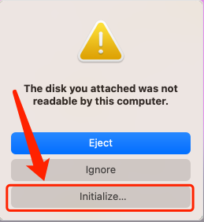
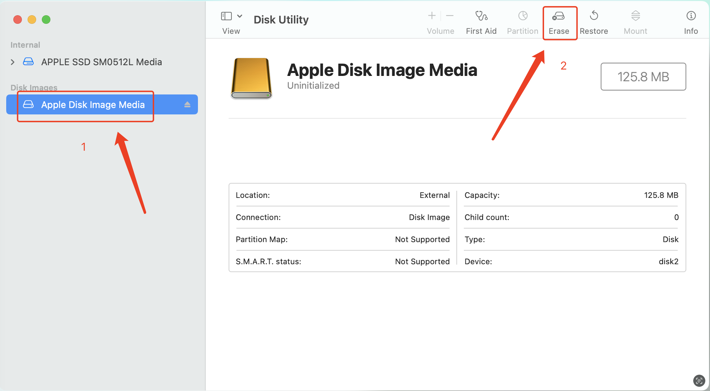
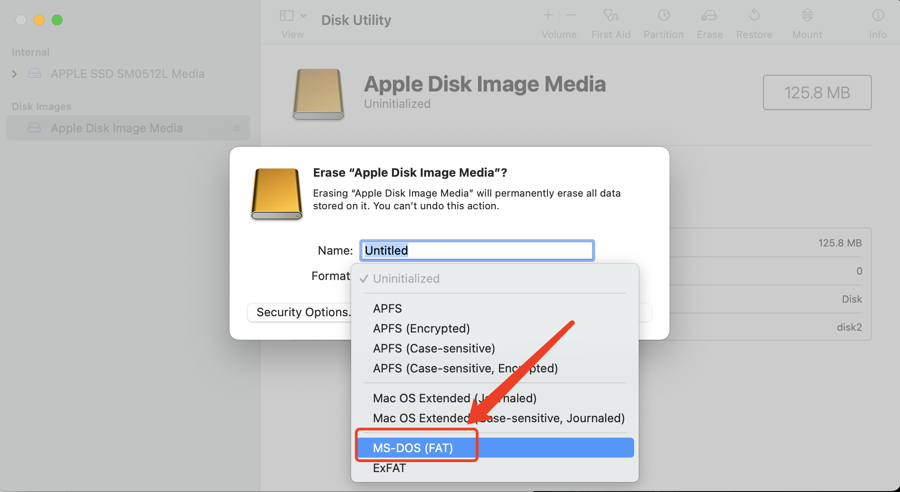
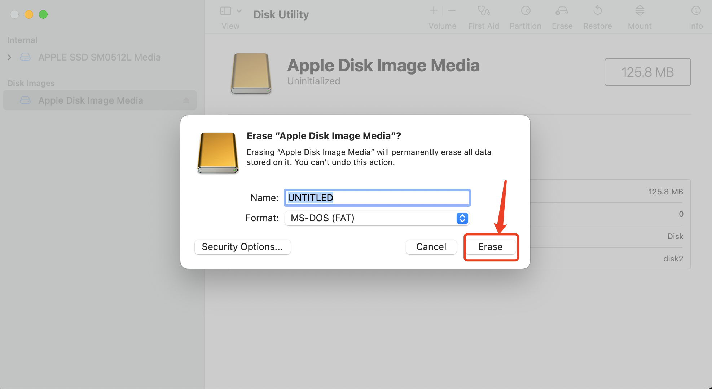
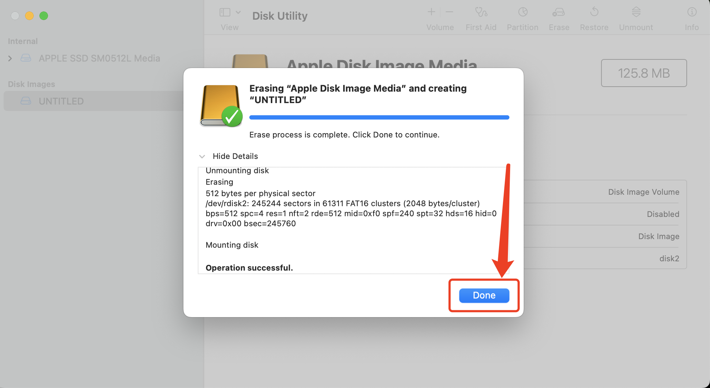
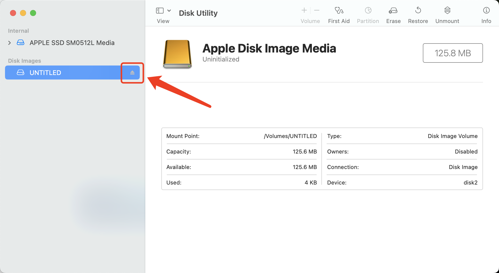
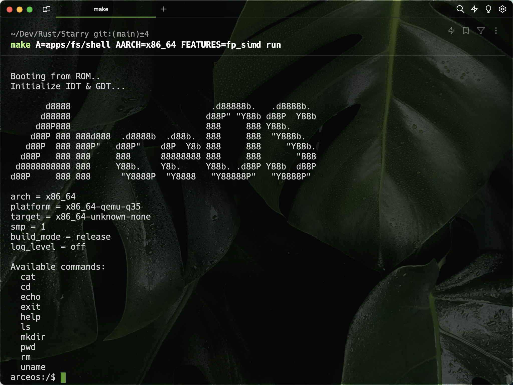

# `macOS` 开发 `StarryOS` 环境部署说明

[StarryOS](https://github.com/Arceos-monolithic/Starry)，一个基于ArceOS实现的宏内核。

> Starry意指布满星星的，寓意本OS的开发学习借鉴了许多前辈的思路，并将其汇总归一为这个内核。

这是一个介绍如何在`macOS`系统下部署 `StarryOS` 开发环境的说明文档。此文档默认构建`x86_64`架构的`fat`磁盘镜像

[仓库提交记录](https://github.com/Arceos-monolithic/Starry/pull/46) `https://github.com/Arceos-monolithic/Starry/pull/46`

## 操作步骤

以下所有的操作步骤都是在当前项目根目录中操作.

1. 安装 `rust`

```shell
$ xcode-select --install
$ curl --proto '=https' --tlsv1.2 -sSf https://sh.rustup.rs | sh
```

2. 安装 `qemu`

```shell
$ brew install qemu
```

3. 安装 `cargo-binutils`

```shell
$ cargo install cargo-binutils
$ rustup component add llvm-tools
```

4. 创建磁盘文件

```shell
$ dd if=/dev/zero of=disk.img bs=4M count=30
```

5. 给磁盘文件添加文件系统

```shell
$ open disk.img
```

这个时候会弹出一个是否初始化的弹窗, 点击初始化,会打开磁盘管理器



6. 格式化磁盘


6-1 选中磁盘, 点击格式化


6-2 格式化选项选择 `MS-DOS (FAT)`格式


6-3 点击格式化按钮


6-4 格式化完成


6-5 弹出磁盘

7. 后续的磁盘操作

```shell
# 创建文件夹
$ mkdir -p mnt

# 挂载磁盘
$ hdiutil attach disk.img -mountpoint mnt

# 拷贝文件
$ cp -r ./testcases/$FILE/* ./mnt/

# 卸载磁盘
$ hdiutil detach mnt

# 改变文件权限
$ chmod 777 disk.img
```

8. 运行`StarryOS`

```shell
# 运行宏内核
$ make run

# 运行 shell
$ make A=apps/fs/shell AARCH=x86_64 FEATURES=fp_simd run
```

## 运行效果

`macOS`系统下运行`StarryOS`效果


